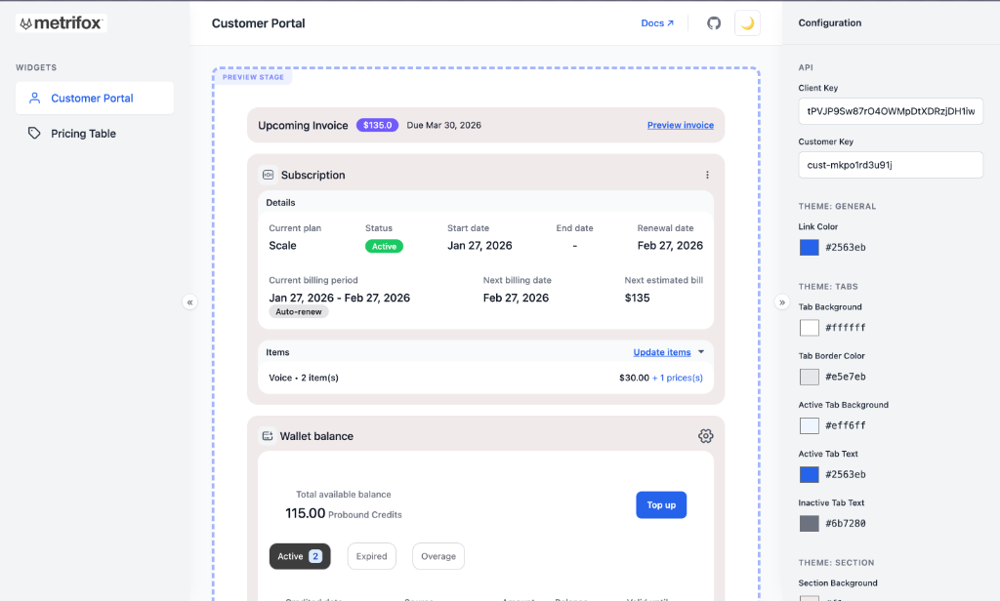
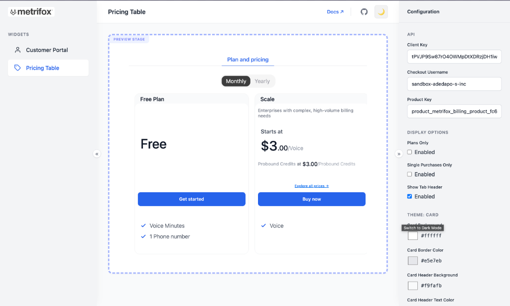
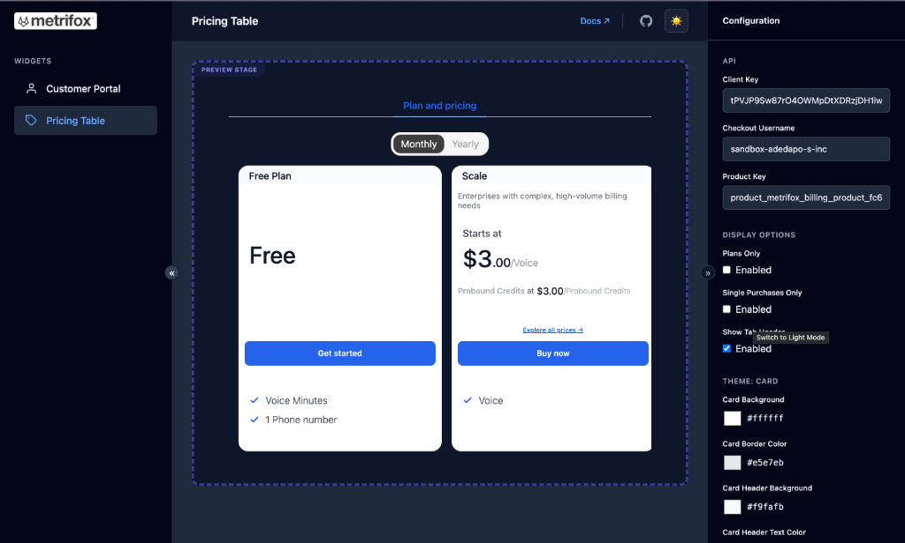

# Metrifox SDK Demos

This repository contains example applications demonstrating how to integrate the **Metrifox SDK** into various frameworks.

## Available Demos

### [React SDK](./react-sdk)

A complete example using React, TypeScript, and Vite.

- **Location:** `./react-sdk`
- **Features:** Customer Portal, Pricing Table, Authentication Provider.

## Getting Started

To run the React demo:

```bash
cd react-sdk
npm install
npm run dev
```

For more details, please refer to the [React SDK README](./react-sdk/README.md).

## Customer Portal

Metrifox's pre-built customer portal allows your users to self-serve their billing needs.

|                                        Light Mode                                        |                                       Dark Mode                                        |
| :--------------------------------------------------------------------------------------: | :------------------------------------------------------------------------------------: |
|  |  |

<br />

## Pricing Table

A conversion-optimized pricing table widget that connects directly to your product catalog.

|                                      Light Mode                                      |                                     Dark Mode                                      |
| :----------------------------------------------------------------------------------: | :--------------------------------------------------------------------------------: |
|  |  |
