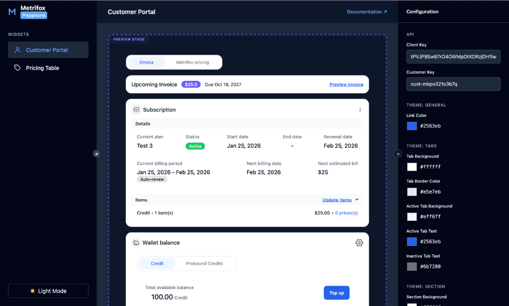
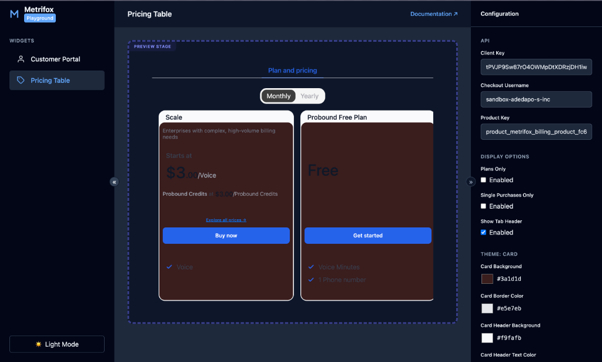

# Metrifox SDK Demos

This repository contains example applications demonstrating how to integrate the **Metrifox SDK** into various frameworks.

## Available Demos

### [React SDK](./react-sdk)

A complete example using React, TypeScript, and Vite.

- **Location:** `./react-sdk`
- **Features:** Customer Portal, Pricing Table, Authentication Provider.

## Getting Started

To run the React demo:

```bash
cd react-sdk
npm install
npm run dev
```

For more details, please refer to the [React SDK README](./react-sdk/README.md).

**Example Screenshots**



