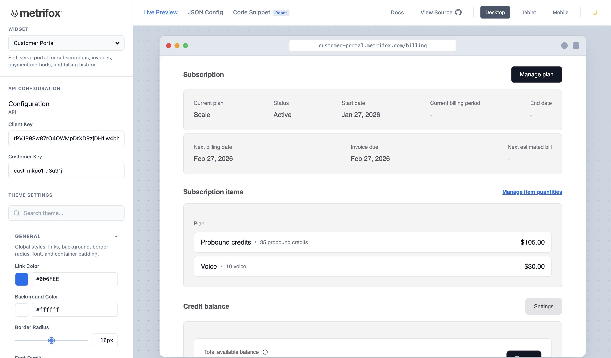
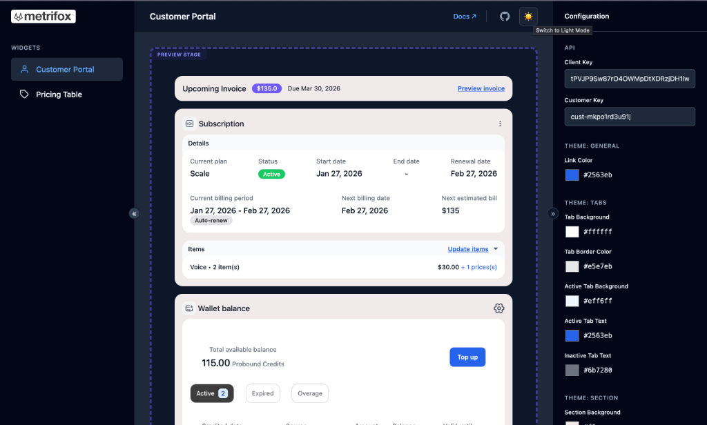
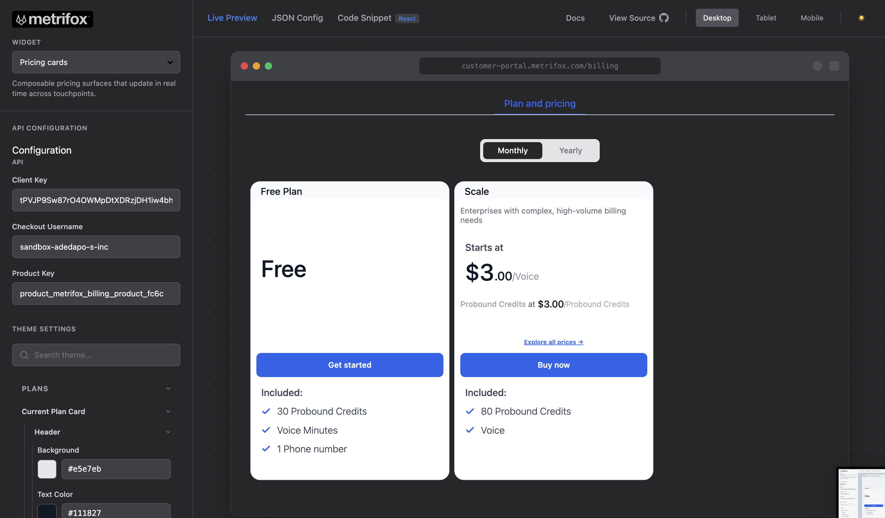

# Metrifox SDK Demos

This repository contains example applications demonstrating how to integrate the **Metrifox SDK** into various frameworks.

## Available Demos

### [React SDK](./react-sdk)

A complete example using React, TypeScript, and Vite.

- **Location:** `./react-sdk`
- **Features:** Customer Portal, Pricing Table, Configuration panel with API keys and Theme options.

### [Angular SDK](./angular-sdk)

A complete example using Angular 19, TypeScript, and the Angular CLI.

- **Location:** `./angular-sdk`
- **Features:** Customer Portal, Pricing Table, Configuration panel with API keys and Theme options (same playground experience as the React demo).

## Getting Started

### React demo

```bash
cd react-sdk
npm install
npm run dev
```

The app will be available at `http://localhost:5173`.

### Angular demo (playground with local SDK)

The Angular demo uses the Angular SDK from a local build so you can test the package like the React SDK. From the **metrifox-sdk-demo** repo:

1. **Build the Angular SDK** (in the [metrifox-angular-sdk](https://github.com/metrifox/metrifox-angular-sdk) repo):

   ```bash
   cd path/to/metrifox-angular-sdk
   pnpm install
   pnpm run build
   ```

2. **Run the Angular demo** (back in this repo):

   ```bash
   cd angular-sdk
   npm install
   npm run dev
   ```

   The app will be available at `http://localhost:4200`.

For more details, see the [React SDK README](./react-sdk/README.md) and [Angular SDK README](./angular-sdk/README.md).

## Customer Portal

Metrifox's pre-built customer portal allows your users to self-serve their billing needs.

|                                             Light Mode                                             |                                            Dark Mode                                             |
| :------------------------------------------------------------------------------------------------: | :----------------------------------------------------------------------------------------------: |
|  |  |

<br />

## Pricing Table

A conversion-optimized pricing table widget that connects directly to your product catalog.

|                                           Light Mode                                           |                                          Dark Mode                                           |
| :--------------------------------------------------------------------------------------------: | :------------------------------------------------------------------------------------------: |
|  |  |
